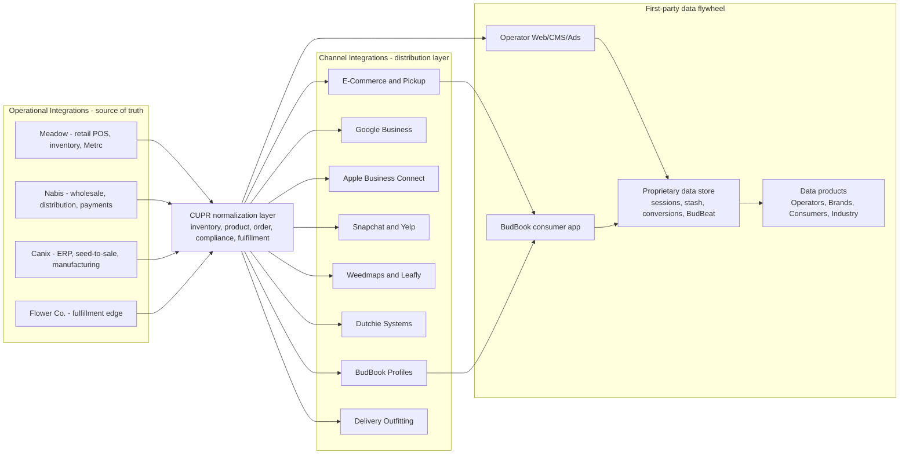

# CŪPR Ecosystem — Internal Reference

> Source-of-truth note for product, marketing, and engineering. Every claim below is
> grounded in copy that currently ships in `cupr_app/`. File paths cite where each
> assertion originates so it stays auditable as the surface evolves. **Do not publish
> this file externally** — it captures pricing assumptions, monetization gaps, and
> regulatory positioning that should be reviewed before any external use.

## 1. Executive summary

CŪPR is a layered cannabis ecosystem. Premium consumer hardware (Vantage / Apache 110)
sits on one end, an operator B2B SaaS spine (CŪPROs) sits in the middle, and BudBook
sits on the other end as both a consumer app and a budtender training layer. Every
layer feeds a shared first-party data store, which CŪPR repackages back to operators,
brands, consumers, and the broader industry as data products.

## 2. Pillars

### 2.1 Vantage — consumer brand & hardware story

- Source: [`app/view.tsx`](../app/view.tsx), nav label "VANTAGE" in [`components/Navbar.tsx`](../components/Navbar.tsx).
- Positioning: premium cannabis hardware ecosystem; "$42B+ TAM"; Whoop / Oura analogue
  for privacy-conscious cannabis consumers.
- Moat: "patent-pending hardware" + integrated software ecosystem.

### 2.2 CŪPROs — compliance-native operator SaaS

- Source: [`components/CuprosIntroShowcase.tsx`](../components/CuprosIntroShowcase.tsx),
  [`components/PlatformContent.tsx`](../components/PlatformContent.tsx).
- Multi-tenant SaaS for dispensaries and smoke shops: websites, e-commerce, listings,
  marketing, customer data.
- AI-assisted (Gemini) site generation, content publishing, campaign support.
- 50-state ad checking, closed-loop attribution, Google/Meta certification tooling.
- Sub-products surfaced via `/cms` tabs: Platform, AI Studio, Social, Digital Ads,
  Print Media, Compliance.

### 2.3 Web layer (`/web`)

- [`components/CMSContent.tsx`](../components/CMSContent.tsx) — 1-click Next.js sites,
  vibe-code control, profile-powered content.
- [`components/EcommerceContent.tsx`](../components/EcommerceContent.tsx) — Retail
  Inventory Tunnel (POS → online), Network Product Hosting (commission-based catalog
  expansion), Print On Demand, Pickup, Delivery.
- [`components/IntegrationContent.tsx`](../components/IntegrationContent.tsx) — Channel
  Integrations (BudBook Profiles, Google, Apple, Snapchat/Yelp, Weedmaps/Leafly,
  Dutchie, Pickup, Delivery).
- [`components/OperationalIntegrationContent.tsx`](../components/OperationalIntegrationContent.tsx)
  — Operational Integrations (Meadow, Nabis, Canix, Flower Co.).

### 2.4 BudBook — consumer app + Pro tier

- [`app/budbook/`](../app/budbook/) — Intro, Journal, Social, Shop, Pro tabs.
- BudBook Pro is a paid subscription for dispensaries, smoke shops, and influencers
  ([`app/budbook/ProTab.tsx`](../app/budbook/ProTab.tsx)): priority SEO, loyalty,
  deals, "Unified Inventory Network" access.
- BudBook is also positioned in [`components/CuprosIntroShowcase.tsx`](../components/CuprosIntroShowcase.tsx)
  as the floor-staff training and enablement layer that bridges operator inventory
  systems to budtender knowledge.

### 2.5 Apache 110 / Lockbox — hardware lineage

- [`app/proprietary/view.tsx`](../app/proprietary/view.tsx) — patent-pending Lockbox
  series, archival blueprints, proprietary ecosystem narrative.

### 2.6 Data products (`/data`)

- Proprietary ([`components/ProprietaryDataContent.tsx`](../components/ProprietaryDataContent.tsx))
  — operator + consumer 1P data: BudBook session logs, stash, Buddy AI, BudBeat.
- Partner ([`components/PartnerDataContent.tsx`](../components/PartnerDataContent.tsx))
  — POS (Dutchie, Flowhub, Treez, Blaze), e-comm (Woo, Shopify-adjacent),
  marketplaces (Leafly, Weedmaps, I Heart Jane), wholesale.
- Third-Party ([`components/ThirdPartyDataContent.tsx`](../components/ThirdPartyDataContent.tsx))
  — Census, Placer.ai, SafeGraph, Cannabis Benchmarks, BDSA, wearables (with consent).
- End-Users ([`components/EndUsersDataContent.tsx`](../components/EndUsersDataContent.tsx))
  — packaged intelligence delivered to Operators / Brands / Consumers / Industry.

## 3. Customer segments

| Segment | Source |
|---|---|
| Dispensaries / cannabis retail | `CuprosIntroShowcase.tsx`, `EcommerceContent.tsx` |
| Smoke shops | `CuprosIntroShowcase.tsx`, `CMSContent.tsx` |
| Independent / mid-market operators | `EcommerceContent.tsx`, `PlatformContent.tsx` |
| Brands, producers, suppliers, distributors, cultivators | `IntegrationContent.tsx`, `EndUsersDataContent.tsx` |
| Cannabis consumers / BudBook users | `app/view.tsx`, `app/budbook/JournalTab.tsx` |
| Influencers | `app/budbook/view.tsx` (BudBook Pro tier copy) |
| Investors, policy researchers, MSOs | `EndUsersDataContent.tsx` |

## 4. Two-layer integration model

## 5. Implied monetization (what the copy actually claims or strongly implies)

| Stream | Evidence |
|---|---|
| Recurring SaaS — CŪPROs | `CuprosIntroShowcase.tsx`; "cancel a subscription" framing in `PartnerDataContent.tsx` |
| Recurring SaaS — BudBook Pro | `app/budbook/ProTab.tsx`, `app/budbook/view.tsx` sidebar copy |
| Commission — Network Product Hosting | `EcommerceContent.tsx` ("Every commission conversion earns revenue") |
| Print-on-demand margin | `PrintMediaContent.tsx`, `EcommerceContent.tsx` |
| Hardware sales (Vantage / Apache 110) | `app/view.tsx`, `CuprosIntroShowcase.tsx`, BudBook Shop |
| Data products / industry intelligence | `EndUsersDataContent.tsx`, `ProprietaryDataContent.tsx` |

## 6. Network effects

- **More operators → bigger Network catalog** ([`EcommerceContent.tsx`](../components/EcommerceContent.tsx)).
- **BudBook Shop drives demand into operator pickup** (`EcommerceContent.tsx`).
- **Session logging enriches Buddy AI → better recs → more sessions logged** (`ProprietaryDataContent.tsx`).
- **BudBook training keeps budtenders sharp → operator sell-through → more CŪPROs data → better channel marketing** (`CuprosIntroShowcase.tsx`).

## 7. Open business-model questions (copy does NOT answer)

These are the gaps a board, investor, or partner deck would surface. They are not bugs
in the marketing site — they are the next round of decisions to make and codify.

1. **Pricing**. No tiers, MRR, or ARPU shown for CŪPROs, BudBook Pro, POD, or commission
   rates. Need a single internal pricing matrix per tier per segment.
2. **B2C ↔ B2B audience handoff at `/`**. Vantage targets consumers; most depth is
   operator SaaS. The path from a consumer hitting the homepage to becoming an
   operator lead (or vice versa) is not articulated.
3. **Schedule III / 280E reconciliation**. `PlatformContent.tsx` describes Schedule III
   as eliminating 280E for medical operators (April 2026). `ComplianceContent.tsx`
   still advertises 280E expense tracking. The copy was updated to clarify that 280E
   tracking covers adult-use operators and prior-period medical filings, but a
   regulatory-claims review (with citations) is still owed.
4. **Operational vs Partner POS overlap**. Operational Integrations centers on Meadow,
   Nabis, Canix, Flower Co. Partner data + Ad Campaigns center on Dutchie, Flowhub,
   Treez. Are these alternative paths, phased priorities, or stacked layers? The
   distinction is not stated.
5. **Data product mechanics**. End-user data products are described in narrative form,
   but the copy does not specify whether they are sold, licensed, or bundled. Consent
   posture and aggregation guarantees beyond high-level claims are missing.
6. **POD / hardware economics**. Print-on-demand rev-share with "integrated print
   partners" is not specified. Hardware COGS, channels (DTC vs retail), and
   attachment rate to BudBook Shop are not specified.
7. **Partner commercial relationship**. Generic "integration" claims for
   Meadow/Nabis/Canix/Flower Co. are not backed by stated commercial relationships
   (revenue share, marketplace listing, white-label, etc.).

## 8. Maintenance

- Copy lives in [`content/`](../content/) — primarily [`tabs.ts`](../content/tabs.ts)
  and [`integrations.ts`](../content/integrations.ts). Edit there before touching JSX.
- Per-route SEO lives in [`app/seo.ts`](../app/seo.ts). Add a new entry whenever a
  new route ships and reference it via `metadataFor(...)` from the new `page.tsx`.
- Tab IDs in `content/tabs.ts` are part of the public contract — `view.tsx` switch
  statements reference them. The contract is locked by snapshot tests in
  [`tests/content/tabs.test.ts`](../tests/content/tabs.test.ts); update the test in
  the same commit if an ID has to change.
